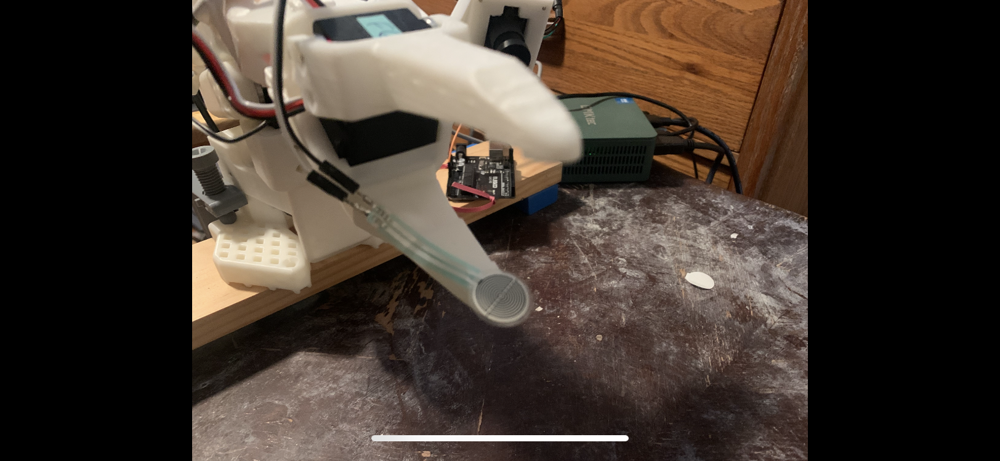
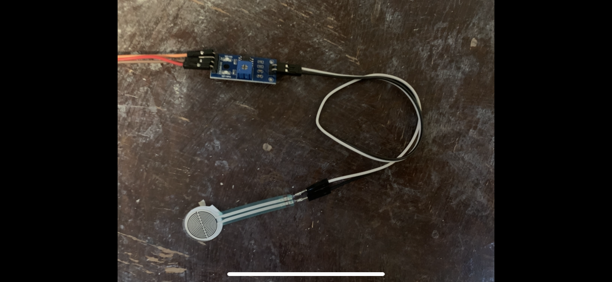

# lerobot_robot_so_sensor_arm



This project extends the standard lerobot SO-101 robot by adding a force sensor at the gripper, enabling force feedback for manipulation tasks. The force sensor is connected via a separate Arduino but is integrated into the robot's observation space, so the sensor reading will be taken into account (as an "observation") during policy training. The robot should be able to learn to use appropriate gripping force, which will protect both delicate objects and the gripper motor.

## Features
- Subclasses the standard `SO101Follower` robot. This accomplishes integrating the force sensor with minimal new code.
- Reads force data from an Arduino-based analog sensor via serial port.
- Compatible with the `lerobot` ecosystem for teleoperation and dataset recording.

## Hardware Requirements
- SO-ARM101 robot
- Arduino (for force sensor interface), I used an old-school (R3) Uno
- Analog force sensor (connected to Arduino A0); I used [Thin Film Pressure Sensor FSR402 Resistance Type Pressure Transducer + Linear Voltage Conversion Module Finger Press Sensing Circuit]


## Arduino Firmware
Upload `force_sensor.ino` to your Arduino. It listens for serial commands:
- `READ` — returns the current force sensor value
- `STATUS` — returns `OK`

**Note: pending TODO: add a wake-up message from the arduino to the computer**

## Installation
This package requires Python 3.10+ and depends on `lerobot`:

Clone this repo, cd, then (with your conda environment activated)

```sh
pip install -e .
```

## Basic Setup Test
Example to test (see `examples/test_robot_connection.py`):

```python
from lerobot_robot_so_sensor_arm import SOSensorArmConfig, SOSensorArm

config = SOSensorArmConfig(port="/dev/YOUR_ROBOT_SERIAL_PORT", sensor_port="/dev/YOUR_SENSOR_SERIAL_PORT")
arm = SOSensorArm(config)
arm.connect(calibrate=False)
obs = arm.get_observation()
print(obs)
```

This observation should now have the 6 joint angles *plus* 1 sensor measurement. My sensor readings sit at zero and increase as pressure is applied to the sensor.

## Command-line Teleoperation & Recording

Then, use the lerobot python or command-line scripts like you would with the default SO-100/SO-101. 

**Be sure to include sensor_port argument for the robot.**

## Note on Motivation

I had wondered how lerobot/so-arm/so-100/so-101 deal with excessive gripper force.  When recording training examples, delicate gripping leads to dropped objects during inference. This creates a motive to grip objects more firmly during training, but with rigid objects this results in the gripper servo stalled in a high current condition as the Proportional control tries to reduce position error. Granted, the so-arm has lower limits set on the current for the gripper motor (as of early 2026 at least), but I did see reports of burned out gripper servos, presumably due to over-exertion, as in: https://huggingface.co/blog/sherryxychen/train-act-on-so-101

Ultimately, I plan to modify the dataset recording script to take the gripper force into account, and to not update to tighter gripper actions as long as this force is above a certain threshold. The "action" itself will be modified (clamped to the last value before gripping force exceeded the threshold), so that the training dataset will contain actions for the gripper that correspond to the correct amount of force, even if the teleoperator has closed the gripper further during training.

## Note on Sensor

It seems that with this sensor the measurement results mainly from deformations of the sensor plane; it responds more to regions of it being pressed than to, for example, a large flat object being pressed straight down across its entire surface of the sensor. I am interested to see in experiments whether this causes any issues with properly sensing gripping force on the large (compared to the sensor), flat face of an object.

I plan to add a solid backing behind the sensor that attaches to the gripper's bottom jaw, and a felt or rubber pad onto the front of the sensor. Having some amount of deformable material in the gripper system should make it easier to moderate force during gripping.

## HuggingFace
Find me over on huggingface!
user: primordial-spork

## License
MIT

## Author
Aaron Epperly (<20829509+ayerone@users.noreply.github.com>)
